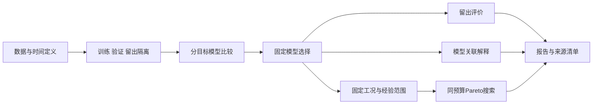

# 污水处理水质与能耗的可解释建模及多目标优化

分别预测出水总氮（TN_out）与全厂日总电耗（DEC），分析模型关联，并在相同工况和历史支持范围内比较候选方案。项目关注模型可靠性、比较条件一致性，以及水质改善与电力投入的权衡。

**研究代码可追溯，公开演示无需私密数据。** 当前阶段为离线研究与候选情景分析，没有接入工厂控制系统，也没有将代理预测变化作为已实现的节能收益。

[项目架构](docs/ARCHITECTURE.md) · [复现说明](docs/REPRODUCIBILITY.md) · [实测结果](docs/DEMO_RESULTS.md) · [中文面试问答](INTERVIEW_QA.md)

## 解决的问题

| 常见问题 | 项目处理 |
|---|---|
| 水质与电耗的信息需求不同 | 分目标比较模型和历史资料范围 |
| 预处理或集成容易使用留出信息 | 折内Pipeline、折外预测与数据隔离测试 |
| 不同背景的方案难以直接比较 | 固定工况并定义经验搜索范围 |
| 单一最优值掩盖目标交换 | 保留Pareto候选、目标端点与同域参照 |
| 私有数据无法直接公开复现 | 独立合成演示、参数记录与产物哈希 |

## 已实现

- 研究代码覆盖15种基础模型、5种集成及均值参照的比较，最终代理、PFI/SHAP/ALE分析，以及条件多目标搜索。
- 公开演示生成滞后三日输入，比较4个精简候选，按验证集选择后评价独立留出集，再计算置换重要性并进行搜索。
- NSGA-II、SPEA2、MOEA/D与随机参照共享代理、情景和调用预算。
- 提供命令行入口、本地HTML与Markdown报告、Pareto图、协议、选择锁和结果清单。
- 10项测试覆盖数据隔离、预处理、预算、范围和产物；上传采用逐文件白名单。

项目的研究与工程特点是目标特异建模、明确的时间语义、同域比较和证据可追溯，不宣称发明新的机器学习或多目标算法。

## 快速运行

推荐Python 3.11。从仓库根目录执行PowerShell命令：

```powershell
py -3.11 -m venv .venv
& ./.venv/Scripts/python.exe -m pip install -e .
& ./.venv/Scripts/python.exe -m tn_dec_demo --quick --output demo_outputs/quick_01
```

运行后用浏览器打开 `demo_outputs/quick_01/report.html`。同目录还有报告、图件、协议和哈希清单。输出目录必须尚不存在，以保护已有结果。

完整演示、测试及多种子重复运行：

```powershell
& ./.venv/Scripts/python.exe -m tn_dec_demo --output demo_outputs/full_01
& ./.venv/Scripts/python.exe -m unittest discover -s tests -v
& ./.venv/Scripts/python.exe tools/benchmark_demo.py --output demo_outputs/benchmark_01
```

macOS/Linux可使用虚拟环境中的python执行相同模块。已实测环境及边界见复现说明。

## 实测验收

2026-09-16完成3个合成数据种子的重复运行，共108次搜索、27,648次双目标代理评价；10项测试通过。精度、方法排名、时间分位和统计单位见[实测结果](docs/DEMO_RESULTS.md)。

指标来自人工生成机制，用于检查流程完整性，不替代真实工厂或跨场景验证。各方法的实际排名完整保留。

## 流程



## 代码导览

| 路径 | 用途 |
|---|---|
| `tn_dec_demo/` | 独立合成演示，适合首次运行 |
| `tests/test_demo.py` | 数据隔离、预算与产物核验 |
| `tools/benchmark_demo.py` | 多种子重复运行 |
| `Paper/SourceCode/src/taici/` | 原研究预测、代理与解释模块 |
| `Paper/SourceCode/scripts/`、`configs/` | 原研究入口与配置 |
| `Paper/revision_20260905/code/` | 条件多目标研究代码 |
| `tools/check_repository_safety.py` | 白名单与敏感内容检查 |

原研究代码依赖受保护的本地数据与冻结模型，公开演示不读取这些材料。原强化学习代码作为研究历史保留；当前主线为代理预测、解释与条件多目标优化。

## 数据与发布范围

原始数据、Excel/CSV、模型、论文及SI、实验结果、厂区流程材料、Legacy归档和个人信息不随仓库发布。演示数据由独立公式生成，不是原始记录的匿名化副本。

`.gitignore`采用逐文件白名单，新文件默认不上传。首次克隆后启用保护检查：

```powershell
git config --local core.hooksPath .githooks
python tools/check_repository_safety.py --self-test
python tools/check_repository_safety.py --staged
python tools/check_repository_safety.py --history
```

检查用于发现常见误上传，不替代新增文件的内容审阅。数据与论文获取须另行遵守相应授权。

## 方法参考

[scikit-learn数据隔离与Pipeline](https://scikit-learn.org/stable/common_pitfalls.html)；
[pymoo NSGA-II实现](https://pymoo.org/algorithms/moo/nsga2.html)。
